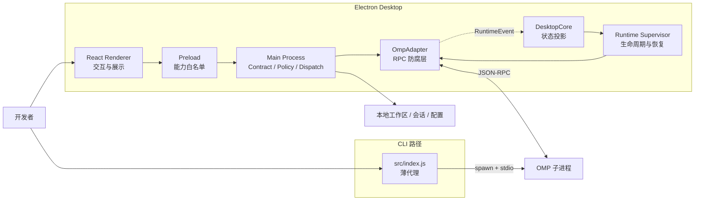
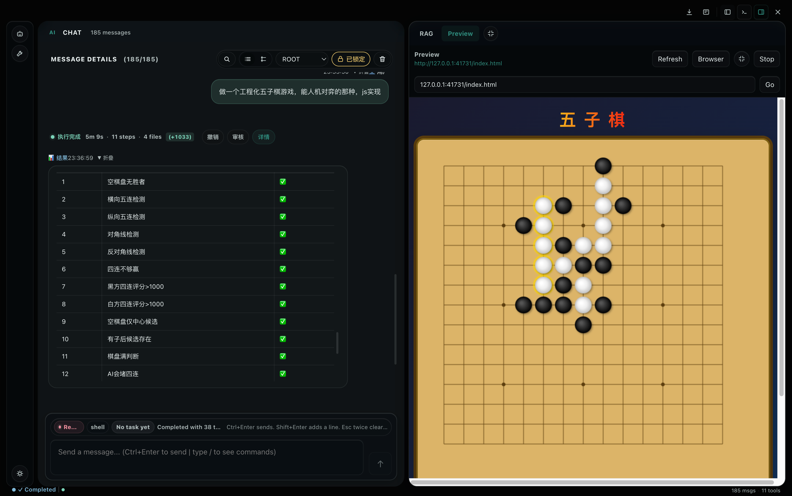
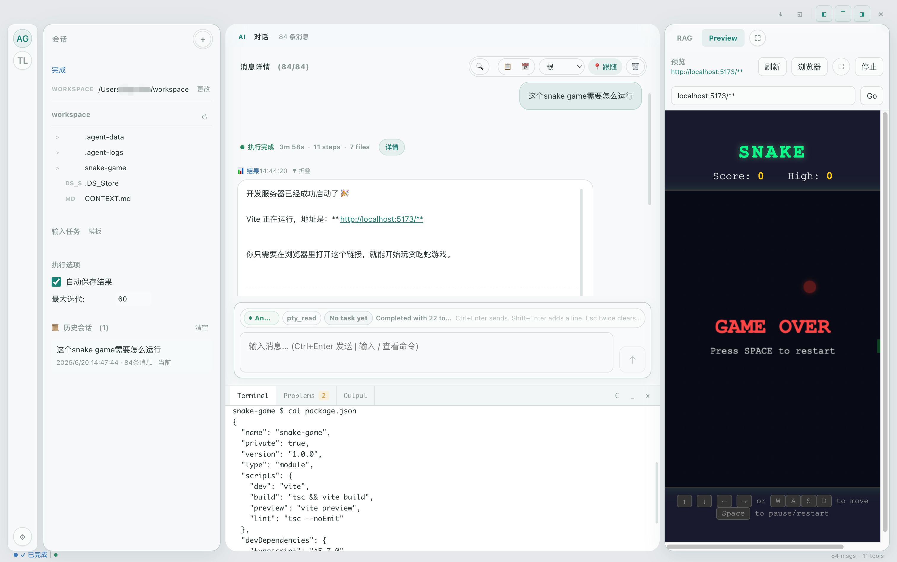
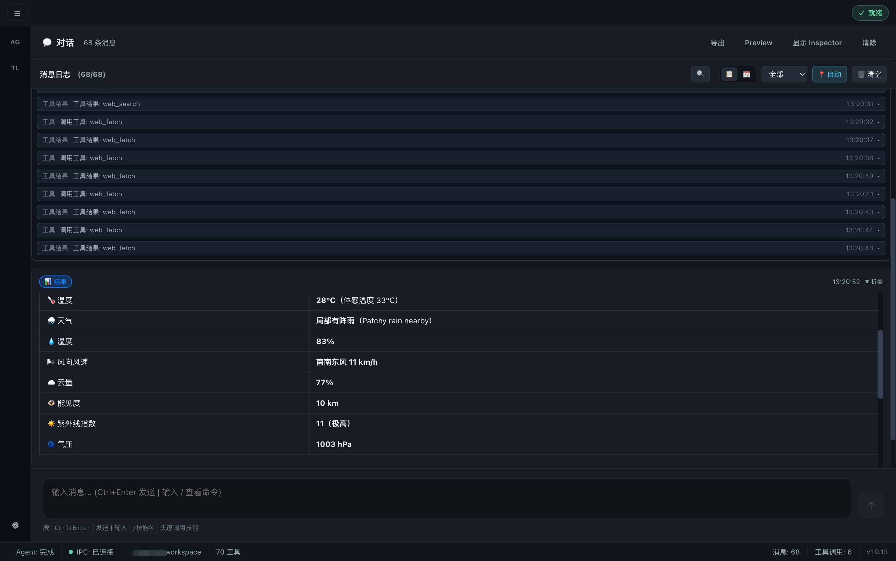

# AI Engineering Mastery Agent

AI Engineering Mastery Agent（Mastery）是一个本地优先的 AI 编码工作台。项目提供两条独立入口：

- **CLI**：直接启动 [oh-my-pi（OMP）](https://github.com/oh-my-pi/oh-my-pi) CLI，并透传参数、环境和标准输入输出。
- **Desktop**：基于 Electron + React 的工作台，通过独立 OMP RPC 子进程提供持续对话、工作区浏览、会话管理和运行过程展示。

Mastery 不实现 OMP 内部的推理、工具调度或模型 Provider 算法。它关注的是可靠、安全地把 Agent Runtime 接入本地开发工作流。

> 完整架构、边界和演进状态见 [docs/architecture.md](./docs/architecture.md)，界面动作与能力映射见 [docs/ui-action-graph.md](./docs/ui-action-graph.md)。运行代码是行为真相来源，架构文档是设计意图和允许依赖的真相来源。

## 当前架构

项目采用**端口适配器式模块化单体 + 进程外 Agent Runtime**。Electron Main Process 是本地特权边界，Renderer 被视为不可信；只有需要权限或故障隔离的能力进入独立进程。



关键设计：

- **CLI 与 Desktop 生命周期分离**：CLI 不创建 `DesktopCore`，避免为终端入口引入 Electron 成本。
- **OMP 进程隔离**：`OmpAdapter` 负责 RPC 关联和协议转换，`RuntimeSupervisor` 负责异常退出恢复、重启预算和 Engine 重绑。
- **契约优先的 IPC**：未注册 contract 的命令默认拒绝；Main Process 统一执行输入/输出校验、能力检查和策略决策。
- **稳定事件语言**：OMP 原始帧被转换为带版本、顺序和因果元数据的 `RuntimeEvent Envelope v1`。
- **本地状态权威**：工作区文件、会话和配置保存在本机；Renderer 状态是可丢弃的展示投影。
- **最小权限 Renderer**：启用 Electron sandbox 和 context isolation，Preload 只暴露明确白名单，不向页面提供 Node 或原始 `ipcRenderer`。

## 已实现能力

- OMP Agent 的启动、停止、状态查询、流式事件和异常退出恢复。
- 单主窗口 Desktop 工作台、工作区文件浏览、会话保存与恢复。
- Conversation Turn、Tool Run 和运行详情投影，增量文本批处理与历史内容折叠。
- Capability Registry 与基础 Policy Engine；Renderer 可发现能力的 available、degraded 或 unavailable 状态。
- 工作目录安全切换：Runtime 就绪后才提交文件服务、配置和 watcher。
- 模型配置与密钥存储；Desktop 中密钥优先使用 Electron `safeStorage`。
- 一次性 Terminal command；高风险命令的最终约束位于 Main Process。
- 外部本地 Preview URL 的 sandboxed viewer。

内置 Preview runner 已移除，当前 Preview capability 会明确报告 `unavailable`；项目也尚未提供逐次授权界面、持久事件重放、消息列表虚拟化或跨设备同步。这些限制不应被描述为现有能力。

## 运行环境

| 场景 | 运行时 | 要求 |
| --- | --- | --- |
| 安装、CLI、测试 | Bun | `>= 1.3.14` |
| Desktop 开发与构建 | Node.js | `>= 20` |
| Desktop Renderer | Vite | 以 `package.json` 锁定版本为准 |

Node 18 不是支持基线。依赖版本以 `package.json` 和 Bun lockfile 为准。

## 安装与启动

```bash
git clone https://github.com/novvoo/mastery.git
cd mastery
bun install
cp .env.example .env
```

按需在 `.env` 中配置模型 Provider 和 API Key，然后启动：

```bash
# CLI
bun run start

# Desktop 开发模式
bun run desktop:dev
```

CLI 会把额外参数直接传给 OMP：

```bash
bun run start -- --help
```

常见模型配置示例：

```env
MODEL_PROVIDER=openai
OPENAI_API_KEY=sk-xxx
OPENAI_BASE_URL=https://api.openai.com/v1
OPENAI_MODEL=gpt-4o
```

更多 OpenAI-compatible、DeepSeek、Zhipu、OpenRouter、本地模型和代理配置见 [.env.example](./.env.example)。

## 验证

提交前统一门禁：

```bash
bun run verify
```

该命令依次运行 ESLint、Renderer 生产构建、单元测试和 Desktop 测试。也可以单独执行：

```bash
bun run lint
bun run desktop:renderer:build
bun run test:unit
bun run test:desktop
bun run test:architecture
```

架构契约测试位于 `tests/unit/architecture-contract.test.js`，用于检查关键依赖边界、安全配置和文档同步要求。

## 构建与发布

```bash
# CLI 产物
bun run build:cli

# 当前平台 Desktop 产物
bun run desktop:build

# 指定或全部 Desktop 平台
bun run desktop:build:mac
bun run desktop:build:win
bun run desktop:build:linux
bun run desktop:build:all

# CLI + Desktop
bun run build:all
```

Renderer 由 Vite 构建并打包进 Electron。Desktop 可生成 macOS DMG/ZIP、Windows NSIS/portable 和 Linux AppImage/DEB；实际跨平台构建能力仍取决于构建主机和工具链。

### macOS 首次打开

社区构建尚未完成 Apple Developer ID 签名和 notarization 时，Gatekeeper 可能提示应用“已损坏”。请先确认安装包来自可信的项目 Release，并选择匹配架构的 `arm64` 或 `x64` 产物。

确认来源后，可在安装到 `/Applications` 后移除隔离标记：

```bash
xattr -dr com.apple.quarantine "/Applications/AI Engineering Mastery Agent.app"
```

## 代码导航

| 领域 | 主要位置 |
| --- | --- |
| CLI 薄代理 | `src/index.js` |
| Desktop 生命周期 | `src/adapters/desktop/desktop-core.js` |
| OMP RPC 适配 | `src/adapters/desktop/omp-adapter.js` |
| Runtime Supervisor | `src/adapters/desktop/runtime-supervisor.js` |
| Event Envelope | `src/runtime/event-bus/records.js` |
| Command Contract | `src/adapters/desktop/protocol/command-contracts.js` |
| Capability / Policy | `src/adapters/desktop/capability-registry.js`、`policy-engine.js` |
| Main Process 路由 | `desktop/main-app/ipc-router.js` |
| 安全 Preload | `desktop/preload.cjs` |
| React 组合根 | `desktop/renderer/App.jsx` |
| Renderer Runtime 投影 | `desktop/renderer/runtime/` |
| 架构契约测试 | `tests/unit/architecture-contract.test.js` |

## 安全与数据边界

- BrowserWindow 强制关闭 Node integration，并启用 context isolation、sandbox 和 web security。
- Renderer 只能通过 Preload 白名单请求能力；路径在 Main Process 中相对当前工作区解析并防止目录穿越。
- 外部链接只接受 `http:` 和 `https:`；预览内容在 sandboxed iframe 中运行。
- RuntimeEvent 是 at-most-once 的实时通知，内存事件缓冲仅用于有限诊断，不是持久队列。
- 当前默认策略 profile 为 `local-full`，尚无逐次 consent UI。Mastery 可以读写工作区和执行本地命令，因此只应在可信项目目录中使用。

## 当前限制与演进状态

架构演进使用三种状态：`完成`、`进行中` 和 `Target`。当前：

- Event Envelope v1 与 Runtime Supervisor 已完成，并有自动化契约证据。
- 版本化 Command Schema、Capability Registry / Policy 和 Renderer Projection 仍在进行中。
- 部分 IPC channel 仍使用通用 object validator。
- Policy 尚未消费 capability 实时状态，也没有逐次授权和团队策略 profile。
- 消息列表尚未虚拟化；projection 不支持持久重建。
- correlation / causation 元数据尚未端到端贯通 IPC、OMP RPC、工具调用和日志。
- 当前只承诺单用户、单设备、单主窗口，不承诺多窗口一致性或跨设备同步。

涉及进程边界、状态权威、IPC 语义、安全不变量或一致性模型的变更，应同步更新 [架构文档](./docs/architecture.md)、相关 ADR、实现和测试。

## 截图





## License

MIT（以 `package.json` 中的包元数据为准）。
